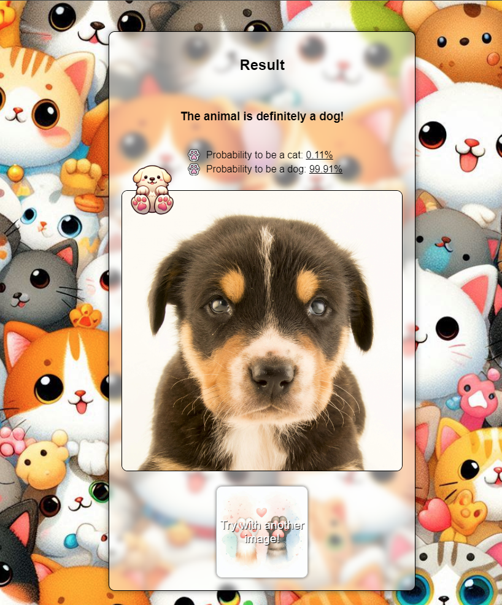
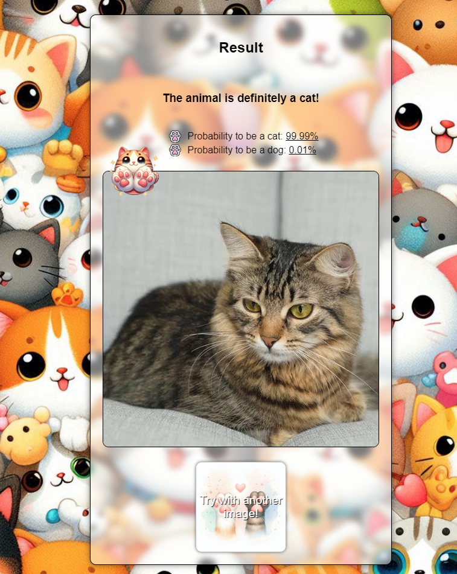

# Cats vs Dogs Classifier

This repository contains a Convolutional Neural Network (CNN) designed to classify images of cats and dogs. Along with the model, there's a simple and fun web app where you can test the classifier yourself!

<p>
 
</p>

<p>
 
 
</p>

<p>
 
</p>

## Model Architecture

The neural network comprises:

- 6 convolutional layers
- 4 max pooling layers
- 3 fully connected layers

The model has a total of **9,584,130 parameters**.

## Dataset and Preprocessing

The model was trained using the [Microsoft Cats vs Dogs dataset](https://www.kaggle.com/datasets/shaunthesheep/microsoft-catsvsdogs-dataset) from Kaggle, which contains 25,000 images of cats and dogs.

### Preprocessing steps

1. Convert all images to RGB.
2. Resize all images to 128x128 pixels.
3. Apply data augmentation transformations (horizontal flip and rotation).
4. Normalize pixel values using a mean of 0.5 and a standard deviation of 0.5 for each channel.

## Training Details

- The dataset was split as follows:
  - **80%** for training
  - **10%** for validation
  - **10%** for testing
- The model was trained for **30 epochs** with a batch size of 64.
- Peak validation performance was achieved around the 15th epoch.
- Training time: ~45 minutes on an NVIDIA 3060Ti, but similar results can be achieved on a CPU.

### Final Metrics

- **Validation Loss (Last Batch):** 0.144
- **Test Loss:** 0.159
- **Test Accuracy:** 94.9%

For more details, you can check the `train.log` file.

## Running the App Locally

To set up the environment, train the model, and run the web app locally, follow these steps:

```bash
python -m venv ./env
source ./env/bin/activate
pip install -r requirements.txt
cp .env.example .env # fill in your Kaggle credentials for auto-download
python train.py
flask --app server.py --debug run
```
